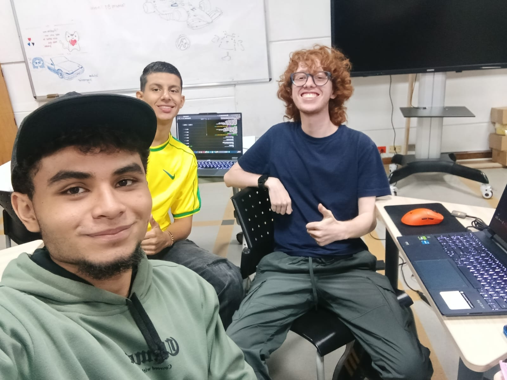

# Taller_2
Repositorio para el segundo taller de Lógica de Programación, enfocado en el aprendizaje y uso de **Variables y Condicionales en Java** y el refuerzo de herramientas como **git y GitHub**.

> [!NOTE]
> Para poder ver y ejecutar el código de este repositorio correctamente, se debe tener tanto el JDK instalado en el equipo, como los complementos correspondientes de Java en VSCode. Esto se explica mas a fondo en este README.

## Integrantes del trabajo

- Jeronimo Arcila 
- Juan Pablo Ortiz
- Matias Munera

## Archivos del repositorio

- **Ecuaciones.java**: Codigo con 20 variables declaradas de distinto tipo, de los cuales 5 valores se reasignaron con valores ya almacenados en otras variables, y el resto con nuevos datos hardcoded.

- **Variables.java**: Codigo con un menú que permite al usuario elegir entre dos ecuaciones a resolver, tambien permitiendo ingresar los valores x y z, para evaluar la expresión e imprimir el resultado.

- **README.md**: Lo que estás leyendo en este momento.

- **team.jpeg**: Foto del trabajo en equipo.

> [!WARNING]
> Ecuaciones.java no está pensado para ejecutarse, sinó para que su contenido sea analizado.

## Desarrollo de trabajo

Nos reunimos en persona para realizar la mayor parte de este trabajo, cada uno con su PC. Se creó el repositorio y se clonó en los equipos que aún no lo tenían. Al tener todos permisos de colaborador, pudimos ir haciendo commits, pushes y finalmente pulls para que todos tuvieramos los archivos correctamente en nuestros equipos.

Nos aseguramos que el trabajo fuera totalmente equitativo, y esto se puede ver al todos tener 10 commits al final del taller.

Se creo el archivo **Variables.java** en el cual se trabajo en equipo y posteriormente se creo el archivo **Ecuaciones.java**, el cual se concluyo tambien entre los tres compañeros. 

## Como ver y ejecutar correctamente el código

Entra al repositorio de GitHub, dirigete al botón verde que dice "**<> Code**" y selecciona "**Download ZIP**", esto descargará los archivos de este repositorio.

Con esto, podrás abrir la carpeta con **Visual Studio Code** y podrás ejecutar los códigos de Java.

Puedes ejecutar los archivos directamente desde tu consola con los comandos "**javac Ecuaciones.java**" para compilar el archivo, y despues "**java Ecuaciones.java**" para correr el código, todo desde el cmd si se requiere.